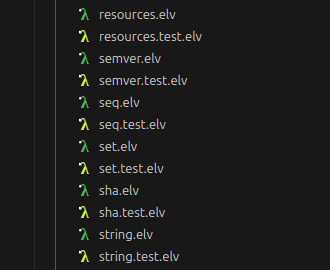

# elvish-icons

_Source code file icons for the Elvish shell_

**elvish-icons** is a mini-project whose purpose is to provide icons for [Elvish](https://elv.sh/) source files - with either `.elv` or `.test.elv` extension - also explaining how to plug them into the [Material Icon Theme](https://github.com/material-extensions/vscode-material-icon-theme) for Visual Studio Code.



## Installation

1. Clone the repository.

1. From within the repository directory, run:

   > elvish install.elv

   or just copy the **.svg** icons from the `icons` subdirectory to `~/.vscode/extensions/icons`.

1. In VS Code, press `CTRL+SHIFT+P` and choose `Preferences: Open User Settings (JSON)`

1. Add the following key to the JSON object:

   ```json
   "material-icon-theme.files.associations": {
     "*.elv": "../../icons/elvish",
     "*.test.elv": "../../icons/elvish-test"
   }
   ```

   or just add the 2 extensions if `material-icon-theme.files.associations` is already defined.

1. If the file icons haven't appeared yet, restart VS Code - or just press `CTRL+SHIFT+P` and choose `Developer: Reload Window`.

## Further references

- [Elvish](https://elv.sh/)

- [Material Icon Theme](https://github.com/material-extensions/vscode-material-icon-theme)
